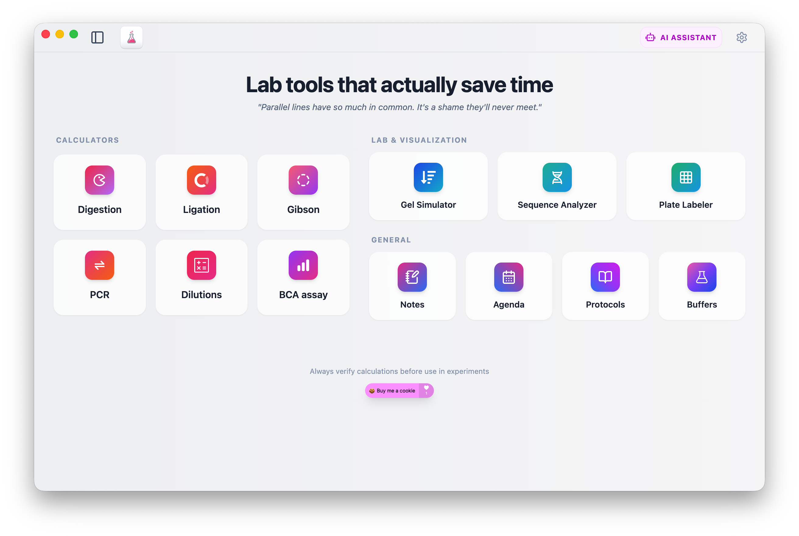

# BiBaBench Buddy

<div align="left">
  <a href="https://bi-ba-bench-buddy.vercel.app/">
    
  </a>
  <a href="https://github.com/DaphneHoutackers/BiBaBench-Buddy/releases/latest/download/BiBaBench-Buddy-mac-arm64.dmg">
    
  </a>
  <a href="https://github.com/DaphneHoutackers/BiBaBench-Buddy/releases/latest/download/BiBaBench-Buddy-Setup.exe">
    
  </a>
  <a href="https://img.shields.io/github/downloads/DaphneHoutackers/BiBaBench-Buddy/total?style=for-the-badge&logo=github&label=downloads">
    
  </a>
</div>

BiBaBench Buddy is a desktop and web app for molecular biology workflows. It combines lab calculators, visualization tools, protocol support and utility tools in one workspace.

<p align="center">
  
</p>

## 🚀 Features

### 🧬 Calculators
- **Digestion**: single and batch restriction digest calculations
- **Ligation**: single and batch ligation setup
- **Gibson Assembly**: single and batch fragment assembly planning
- **PCR toolkit**:
  - PCR Mix calculator
  - Ta (annealing temperature) calculator
  - OE-PCR planner
  - PCR product sequence generator
- **Dilutions**:
  - C₁V₁
  - sample dilution
  - add-to-volume
  - serial dilution
- **Protein tools**:
  - BCA assay calculator
  - SDS-PAGE sample prep helper

### 🧪 Lab & visualization
- **Gel Simulator**:
  - DNA gel simulation
  - Western blot migration mode
- **Sequence Analyzer**:
  - sequence/plasmid analysis
  - map + feature inspection
  - alignment support
  - sequence library integration
- **Plate Labeler**:
  - 24/48/96/384 well plate layouts
  - coloring, labeling and export/copy support

### 🧰 General lab tools
- **Buffer & Medium Builder**: create, organize and reuse buffer/media recipes
- **Protocols**:
  - protocol library
  - AI protocol generator
- **Notes**: rich text lab notes with folders
- **Agenda**: planning tool for experiments and deadlines

### 🤖 AI features
- **AI Lab Assistant**: general molecular biology / calculation chat assistant
- **AI Buffer Assistant**: conversational buffer-recipe assistant inside the buffer workflow

### ⚙️ Workflow features
- Login/sync support (Email or GitHub)
- Per-user settings and API key configuration (Gemini/OpenAI/Groq/OpenRouter/Anthropic/DeepSeek)
- Tool/tab history and restoration
- Theme and appearance customization

## 🌐 Use & installation

### Web app
Open directly in browser:

**https://bi-ba-bench-buddy.vercel.app/**

### Desktop app
Download the latest release:

- **macOS (Apple Silicon)**:  
  https://github.com/DaphneHoutackers/BiBaBench-Buddy/releases/latest/download/BiBaBench-Buddy-mac-arm64.dmg
- **Windows**:  
  https://github.com/DaphneHoutackers/BiBaBench-Buddy/releases/latest/download/BiBaBench-Buddy-Setup.exe
- **All releases**:  
  https://github.com/DaphneHoutackers/BiBaBench-Buddy/releases

#### macOS warning: “App is damaged and can’t be opened”
If macOS blocks the app on first launch, run:

```bash
xattr -cr "/Applications/BiBaBench Buddy.app"
```

## 🛠️ Development

```bash
git clone https://github.com/DaphneHoutackers/BiBaBench-Buddy.git
cd BiBaBench-Buddy
npm install
npm run dev        # web app
npm run app:build  # desktop build
```

## ⚠️ Known issues
- Ta calculator logic is still being refined for some high-GC/complex primer scenarios.
- Sequence Analyzer feature labeling/visualization can still be improved in some cases.

## 📜 Changelog
- Releases overview: https://github.com/DaphneHoutackers/BiBaBench-Buddy/releases

## ☕ Support
If you like this app, you can support the project:

<a href="https://buymeacoffee.com/daphnewoodpecker" target="_blank">
  
</a>
